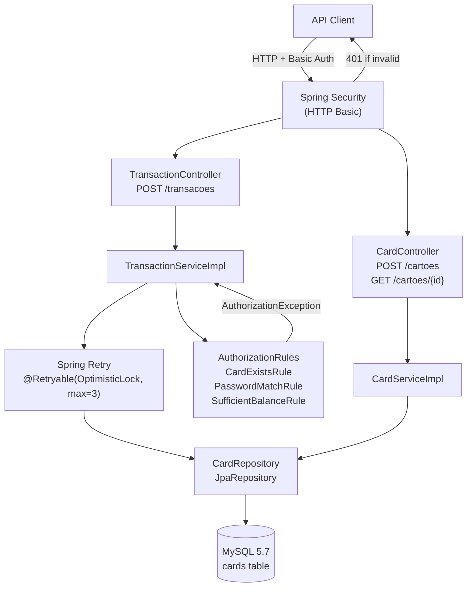

# Design Document — Mini Autorizador

## Overview

O Mini Autorizador é um serviço REST construído com **Spring Boot 4.1.x** e **Java 25 (Virtual Threads)** que processa transações de cartões de benefício (Vale Refeição / Vale Alimentação). Expõe três grupos de endpoints:

| Método | Path | Operação |
|--------|------|----------|
| `POST` | `/cartoes` | Criação de cartão |
| `GET` | `/cartoes/{numeroCartao}` | Consulta de saldo |
| `POST` | `/transacoes` | Autorização de transação |

Todos os endpoints exigem **HTTP Basic Authentication** (credenciais fixas `username` / `password`). O sistema persiste apenas a entidade `Card`; transações não são armazenadas. O controle de concorrência é feito por **Optimistic Locking** via campo `@Version`, com retry automático de até 3 tentativas em caso de conflito.

### Decisões arquiteturais

#### 1. Banco de dados: MySQL 5.7

MySQL foi escolhido em vez de MongoDB pelos seguintes critérios:

- **ACID nativo**: transações multi-statement garantem atomicidade real do débito de saldo sem precisar de transações multi-documento (MongoDB 4.2+ suporta, mas com overhead e configuração adicional).
- **Integração com Spring Boot**: `spring-boot-starter-data-jpa` + Hibernate + Flyway formam um stack maduro e sem fricção. MongoDB exigiria `spring-boot-starter-data-mongodb` e adaptação de todo o padrão de repositório.
- **Optimistic Locking via `@Version`**: JPA/Hibernate suporta `@Version` nativamente com incremento automático e detecção de conflito (`OptimisticLockingFailureException`). Spring Data MongoDB também oferece suporte a `@Version`; porém, a persistência documental exigiria adaptar o repositório e validar o fluxo de retry e concorrência na nova tecnologia.
- **Flyway**: migração declarativa de schema SQL é mais simples de auditar e reverter do que transformações de documentos MongoDB.
- **Familiaridade com o stack**: o projeto de referência `rommanel-pix-integrator` usa JPA + Flyway com SQL Server; MySQL é equivalente neste eixo.

#### 2. Optimistic Locking em vez de Pessimistic Locking

**Pessimistic Locking** (`SELECT ... FOR UPDATE`) bloqueia a linha durante toda a transação. Sob Virtual Threads isso é especialmente problemático: um `SELECT FOR UPDATE` prende o carrier thread enquanto aguarda o lock de banco, anulando o benefício das Virtual Threads para I/O. Além disso, cria contenção severa quando muitas threads competem pelo mesmo cartão.

**Optimistic Locking** com `@Version` deixa a leitura acontecer livremente e só verifica conflito no momento do `UPDATE`. O Hibernate traduz o save em `UPDATE cards SET balance=?, version=? WHERE card_number=? AND version=?`. Se outro thread já incrementou a versão, a exceção `OptimisticLockingFailureException` é lançada. O Spring Retry captura e reexecuta o método (re-leitura + re-avaliação das regras) até 3 vezes antes de retornar `INSUFFICIENT_BALANCE`.

Isso garante que:
- Nenhuma thread fica bloqueada esperando lock.
- O saldo nunca fica negativo (a regra de saldo é reavaliada a cada retry sobre o valor atualizado).
- Virtual Threads operam com plena eficiência de I/O.

#### 3. Única fonte de verdade — sem dual write

O saldo existe **apenas** na tabela `cards` do MySQL. Não há cache distribuído, event sourcing, nem message bus. O débito é um único `UPDATE` atômico protegido por versão. Isso elimina qualquer risco de inconsistência entre sistemas.

#### 4. Virtual Threads

Configurado via `spring.threads.virtual.enabled: true` no `application.yml`. O Spring Boot 4.x configura automaticamente o Tomcat para usar um `VirtualThreadExecutor` como executor padrão. Nenhum bean `Executor` customizado é necessário. Todas as requisições REST e operações de I/O de banco executam em Virtual Threads.

#### 5. No-if design pattern — AuthorizationRule

As regras de autorização são implementadas como uma `List<AuthorizationRule>` injetada em ordem de precedência no `TransactionServiceImpl`. Cada regra implementa a interface funcional:

```java
@FunctionalInterface
public interface AuthorizationRule {
    void evaluate(Card card, TransactionRequest request);
}
```

Cada implementação lança `AuthorizationException(TransactionError.X)` em caso de falha ou passa silenciosamente em caso de sucesso. O service itera a lista com `rules.forEach(...)`. Não há `if/else` chains. Para adicionar uma nova regra, basta criar um novo bean que implemente `AuthorizationRule` e declará-lo como `@Component` — a injeção de lista ordena por `@Order`.

#### 6. Armazenamento de senha: BCrypt

A senha do cartão é persistida como hash BCrypt (`BCryptPasswordEncoder`) no campo `password_hash`. A comparação é feita via `passwordEncoder.matches(rawPassword, storedHash)`. Isso evita exposição de senha em texto plano em logs, backups ou dumps de banco.

---

## Architecture



### Camadas

| Camada | Pacote | Responsabilidade |
|--------|--------|-----------------|
| Controller | `controllers/` | Recebe HTTP, valida DTO (`@Valid`), delega ao service, mapeia response |
| Service | `services/`, `services/impl/` | Lógica de negócio, orquestração das regras, retry |
| Rules | `rules/` | Regras de autorização desacopladas e ordenadas |
| Repository | `repositories/` | Acesso ao banco via JPA |
| Domain | `domains/` | Entidade JPA `Card` |

**Dependências permitidas**: `controller → service → repository`. Nenhuma dependência `controller → repository` ou `repository → service/controller`.

---

## Components and Interfaces

### Package structure

```
com.br.vr.miniautorizador/
├── MiniAutorizadorApplication.java
├── configs/
│   └── SecurityConfig.java
├── controllers/
│   ├── CardController.java
│   └── TransactionController.java
├── domains/
│   └── Card.java
├── enums/
│   └── TransactionError.java
├── exceptions/
│   ├── CardAlreadyExistsException.java
│   ├── CardNotFoundException.java
│   ├── AuthorizationException.java
│   └── handler/
│       └── RestExceptionHandler.java
├── records/
│   ├── requests/
│   │   ├── CreateCardRequest.java
│   │   └── TransactionRequest.java
│   └── responses/
│       └── CreateCardResponse.java
├── repositories/
│   └── CardRepository.java
├── rules/
│   ├── AuthorizationRule.java
│   ├── CardExistsRule.java
│   ├── PasswordMatchRule.java
│   └── SufficientBalanceRule.java
└── services/
    ├── CardService.java
    ├── TransactionService.java
    └── impl/
        ├── CardServiceImpl.java
        └── TransactionServiceImpl.java
```

### CardController

```java
@RestController
@RequestMapping("/cartoes")
@RequiredArgsConstructor
@Slf4j
public class CardController {

    private final CardService cardService;

    @PostMapping
    public ResponseEntity<CreateCardResponse> createCard(@Valid @RequestBody CreateCardRequest request) {
        // returns 201 on success, 422 if duplicate
    }

    @GetMapping("/{numeroCartao}")
    public ResponseEntity<BigDecimal> getBalance(@PathVariable String numeroCartao) {
        // returns 200 + balance, 404 if not found
    }
}
```

### TransactionController

```java
@RestController
@RequestMapping("/transacoes")
@RequiredArgsConstructor
@Slf4j
public class TransactionController {

    private final TransactionService transactionService;

    @PostMapping
    public ResponseEntity<String> authorize(@Valid @RequestBody TransactionRequest request) {
        // returns 201 "OK" on success, 422 with TransactionError code on failure
    }
}
```

### AuthorizationRule interface

```java
@FunctionalInterface
public interface AuthorizationRule {
    /**
     * Avalia a regra para o cartão e transação fornecidos.
     * Lança AuthorizationException com o TransactionError correspondente se a regra falhar.
     * Retorna silenciosamente se a regra for satisfeita.
     */
    void evaluate(Card card, TransactionRequest request);
}
```

### CardService / TransactionService interfaces

```java
public interface CardService {
    CreateCardResponse createCard(CreateCardRequest request);
    BigDecimal getBalance(String cardNumber);
}

public interface TransactionService {
    void authorize(TransactionRequest request);
}
```

### RestExceptionHandler

Segue o mesmo padrão do `rommanel-pix-integrator`: `@ControllerAdvice` com `ProblemDetail` para erros de validação e HTTP customizados. Adiciona handlers específicos para:

- `CardAlreadyExistsException` → HTTP 422 + body `{"numeroCartao": "...", "senha": "..."}`
- `CardNotFoundException` → HTTP 404 sem body
- `AuthorizationException` → HTTP 422 + body com código do `TransactionError` (string)
- `MethodArgumentNotValidException` → HTTP 400
- `HttpMessageNotReadableException` → HTTP 400

---

## Data Models

### Card entity

```java
@Entity
@Table(name = "cards")
@Builder
@Getter
@Setter
@NoArgsConstructor
@AllArgsConstructor
public class Card implements Serializable {

    @Serial
    private static final long serialVersionUID = 1L;

    @Id
    @Column(name = "card_number", nullable = false, unique = true, length = 19)
    private String cardNumber;

    @Column(name = "password_hash", nullable = false, length = 255)
    private String passwordHash;

    @Column(name = "balance", nullable = false, precision = 19, scale = 2)
    private BigDecimal balance;

    @Version
    @Column(name = "version", nullable = false)
    private Long version;
}
```

### Request / Response Records

```java
// CreateCardRequest.java
public record CreateCardRequest(
    @NotBlank String numeroCartao,
    @NotBlank String senha
) {}

// CreateCardResponse.java
public record CreateCardResponse(
    String numeroCartao,
    String senha
) {}

// TransactionRequest.java
public record TransactionRequest(
    @NotBlank String numeroCartao,
    @NotBlank String senhaCartao,
    @NotNull @DecimalMin("0.01") BigDecimal valor
) {}
```

### TransactionError enum

```java
public enum TransactionError {
    CARD_NOT_FOUND,
    INVALID_PASSWORD,
    INSUFFICIENT_BALANCE,
    INVALID_AMOUNT
}
```

### Flyway Migration

```sql
-- V1__create_cards_table.sql
CREATE TABLE cards (
    card_number   VARCHAR(19)    NOT NULL,
    password_hash VARCHAR(255)   NOT NULL,
    balance       DECIMAL(19,2)  NOT NULL DEFAULT 500.00,
    version       BIGINT         NOT NULL DEFAULT 0,
    PRIMARY KEY (card_number)
) ENGINE=InnoDB DEFAULT CHARSET=utf8mb4;
```

### application.yml

```yaml
server:
  port: 8080

spring:
  application:
    name: mini-autorizador
  threads:
    virtual:
      enabled: true
  datasource:
    url: jdbc:mysql://${MYSQL_HOST:localhost}:${MYSQL_PORT:3306}/miniautorizador?useSSL=false&serverTimezone=UTC
    username: ${MYSQL_USER:root}
    password: ${MYSQL_PASSWORD:}
    driver-class-name: com.mysql.cj.jdbc.Driver
  jpa:
    hibernate:
      ddl-auto: validate
    open-in-view: false
    show-sql: false
  flyway:
    enabled: true

management:
  endpoints:
    web:
      exposure:
        include: health,info
  endpoint:
    health:
      show-details: always
```

### pom.xml — dependências principais

```xml
<!-- Spring Boot 4.1.x, Java 25 -->
<parent>
    <groupId>org.springframework.boot</groupId>
    <artifactId>spring-boot-starter-parent</artifactId>
    <version>4.1.0</version>
</parent>

<properties>
    <java.version>25</java.version>
</properties>

<dependencies>
    <!-- Web + Validation + Security -->
    <dependency>spring-boot-starter-web</dependency>
    <dependency>spring-boot-starter-validation</dependency>
    <dependency>spring-boot-starter-security</dependency>
    <dependency>spring-boot-starter-actuator</dependency>

    <!-- Data + MySQL -->
    <dependency>spring-boot-starter-data-jpa</dependency>
    <dependency>mysql:mysql-connector-j (runtime)</dependency>
    <dependency>org.flywaydb:flyway-core</dependency>
    <dependency>org.flywaydb:flyway-mysql</dependency>

    <!-- Retry -->
    <dependency>org.springframework.retry:spring-retry</dependency>
    <dependency>org.springframework:spring-aspects</dependency>

    <!-- Utilities -->
    <dependency>org.projectlombok:lombok (optional)</dependency>

    <!-- Test -->
    <dependency>com.h2database:h2 (test)</dependency>
    <dependency>spring-boot-starter-test (test)</dependency>
</dependencies>

<build>
    <!-- jacoco-maven-plugin 0.8.13 com threshold 80% em verify -->
    <!-- maven-compiler-plugin com lombok annotationProcessorPath -->
    <!-- spring-boot-maven-plugin excluindo lombok -->
</build>
```

### Docker e CI (padrão rommanel-pix-integrator)

**Dockerfile**

```dockerfile
FROM eclipse-temurin:25-jdk
ARG ARTIFACT_NAME
ARG IMAGE_VERSION
ENV JAVA_HOME=/opt/java/openjdk
EXPOSE 8080
ADD target/${ARTIFACT_NAME}*.jar ${ARTIFACT_NAME}.jar
ADD java.security ${JAVA_HOME}/conf/security/
RUN printf "IMAGE_VERSION=${IMAGE_VERSION}" > version.properties
COPY entrypoint.sh ./entrypoint.sh
RUN chmod +x ./entrypoint.sh
ENTRYPOINT ["/bin/bash", "./entrypoint.sh"]
```

**entrypoint.sh**

```bash
source version.properties
echo "Entrypoint running jar: $ARTIFACT_NAME"
echo "Image version: $IMAGE_VERSION"
java -jar "mini-autorizador.jar"
```

**docker.properties**

```properties
IMAGE_NAME=mini-autorizador
MAJOR_VERSION=1
MINOR_VERSION=0
ARTIFACT_NAME=mini-autorizador
```

**.github/workflows/docker.yml** — estrutura idêntica ao `rommanel-pix-integrator`:
- `einaregilsson/build-number@v3` para número de build sequencial
- `madhead/read-java-properties@latest` lendo `docker.properties`
- `actions/setup-java@v4` com `java-version: '25'` e `distribution: 'temurin'`
- `mvn -B package -DskipTests`
- `docker/build-push-action@v5` com tags `{user}/mini-autorizador:{MAJOR}.{MINOR}.{BUILD}` e `latest`

---

## Correctness Properties

*A property is a characteristic or behavior that should hold true across all valid executions of a system — essentially, a formal statement about what the system should do. Properties serve as the bridge between human-readable specifications and machine-verifiable correctness guarantees.*

### Property 1: Card creation round-trip — balance invariant

*For any* valid card number and password (non-blank, non-duplicate), creating the card and then querying its balance SHALL return exactly `500.00`.

**Validates: Requirements 2.1, 2.3, 3.1**

---

### Property 2: Duplicate card rejection preserves existing state

*For any* card that already exists in the system, attempting to create a second card with the same `numeroCartao` (regardless of the password provided) SHALL return HTTP 422 and leave the original card's balance and password hash unchanged.

**Validates: Requirements 2.2**

---

### Property 3: Blank field rejection

*For any* POST `/cartoes` request where `numeroCartao` or `senha` is null, the empty string, or composed entirely of whitespace characters, the system SHALL return HTTP 400 and persist no data.

**Validates: Requirements 2.4**

---

### Property 4: Successful transaction reduces balance by exactly the transaction amount

*For any* card with balance `B` and any transaction amount `V` where `0 < V ≤ B`, authorizing the transaction SHALL result in the card's balance being exactly `B - V`, and the response SHALL be HTTP 201 with body `"OK"`.

**Validates: Requirements 4.1**

---

### Property 5: Invalid amount rejection

*For any* transaction request where `valor` is less than or equal to zero (including zero, negative numbers, and null), the system SHALL return HTTP 422 with body `INVALID_AMOUNT` and leave the card balance unchanged.

**Validates: Requirements 4.9**

---

### Property 6: Authorization rule precedence ordering

*For any* transaction request that violates multiple rules simultaneously (e.g., non-existent card AND wrong password AND insufficient balance), the system SHALL return the error code corresponding to the **first** failing rule in the chain `CARD_NOT_FOUND → INVALID_PASSWORD → INSUFFICIENT_BALANCE`. No subsequent rule SHALL be evaluated after the first failure.

**Validates: Requirements 4.5**

---

### Property 7: Balance never goes negative under concurrent transactions

*For any* sequence of concurrent transaction requests against the same card — regardless of the number of concurrent threads, transaction amounts, or interleaving order — the card's final balance SHALL be greater than or equal to `0.00`.

**Validates: Requirements 5.4, 3.4**

---

### Property 8: Concurrent transaction atomicity — conservation of value

*For any* set of `N` concurrent transactions against the same card, each for amount `V`, where `approved_count` is the number of transactions that received HTTP 201, the final balance SHALL equal `initial_balance - (approved_count × V)`. No value SHALL be lost or created.

**Validates: Requirements 5.1, 8.3**

---

## Error Handling

### Exception hierarchy

```
RuntimeException
├── CardAlreadyExistsException        → HTTP 422, body: CreateCardResponse(numeroCartao, senha)
├── CardNotFoundException             → HTTP 404, no body
└── AuthorizationException(TransactionError)  → HTTP 422, body: TransactionError.name()
```

### RestExceptionHandler mappings

| Exception | HTTP Status | Body |
|-----------|-------------|------|
| `CardAlreadyExistsException` | 422 | `{"numeroCartao": "...", "senha": "..."}` |
| `CardNotFoundException` | 404 | *(empty)* |
| `AuthorizationException(CARD_NOT_FOUND)` | 422 | `CARD_NOT_FOUND` |
| `AuthorizationException(INVALID_PASSWORD)` | 422 | `INVALID_PASSWORD` |
| `AuthorizationException(INSUFFICIENT_BALANCE)` | 422 | `INSUFFICIENT_BALANCE` |
| `AuthorizationException(INVALID_AMOUNT)` | 422 | `INVALID_AMOUNT` |
| `MethodArgumentNotValidException` | 400 | *(empty or ProblemDetail)* |
| `HttpMessageNotReadableException` | 400 | *(empty or ProblemDetail)* |
| `Exception` (fallback) | 500 | ProblemDetail genérico |

**Nota sobre HTTP 422 de cartão duplicado**: o body retornado é o mesmo payload enviado na requisição (`{"numeroCartao": "...", "senha": "..."}`), conforme especificado no Requirement 2.2. O `RestExceptionHandler` recebe a exceção com o `CreateCardResponse` embutido e o serializa diretamente.

### Retry de Optimistic Lock

O `TransactionServiceImpl.authorize()` é anotado com:

```java
@Retryable(
    retryFor = OptimisticLockingFailureException.class,
    maxAttempts = 3,
    backoff = @Backoff(delay = 50)
)
@Transactional
public void authorize(TransactionRequest request) { ... }
```

Após 3 tentativas fracassadas, o `@Recover` retorna `AuthorizationException(INSUFFICIENT_BALANCE)`.

### Logging (padrão liv-customer-register)

- `@Slf4j` em todos os services e controllers.
- Formato: `ClassName.methodName - Description - key: {value}`
- `INFO`: entrada do método com parâmetros, conclusão com resultado, resultado de cada regra de autorização.
- `DEBUG`: steps intermediários, tentativas de retry do OptimisticLocking.
- `ERROR`: exceções inesperadas com stack trace, classe, método e input causador.
- `WARN`: detecção de Virtual Thread pinning > 500ms com nome da operação e ID da thread.

---

## Testing Strategy

### Abordagem dual

A estratégia combina **testes unitários** para exemplos concretos e casos de borda com **testes baseados em propriedades** para invariantes universais.

#### Por que Property-Based Testing se aplica aqui

O Mini Autorizador contém lógica de negócio pura (débito de saldo, validação de senha, avaliação de regras em cadeia) com espaço de entrada grande (números de cartão, senhas, valores decimais) e invariantes universais claros (saldo ≥ 0, conservação de valor). PBT é adequado para cobrir estes cenários.

### Testes unitários

| Classe de teste | Cobertura |
|----------------|-----------|
| `CardServiceImplTest` | createCard (sucesso, duplicata), getBalance (sucesso, não encontrado) |
| `TransactionServiceImplTest` | authorize (sucesso, CARD_NOT_FOUND, INVALID_PASSWORD, INSUFFICIENT_BALANCE, INVALID_AMOUNT, retry) |
| `CardExistsRuleTest` | exceção quando cartão não existe |
| `PasswordMatchRuleTest` | exceção quando senha não bate, passa quando correta |
| `SufficientBalanceRuleTest` | exceção quando saldo insuficiente, passa quando suficiente |
| `CardControllerTest` | mapeamento de status HTTP para cada cenário |
| `TransactionControllerTest` | mapeamento de status HTTP para cada cenário |
| `RestExceptionHandlerTest` | serialização correta do body para cada exceção |

Integração com H2 (`@SpringBootTest`) para validar o stack completo incluindo Flyway, JPA e Security.

### Testes de propriedades (Property-Based Testing)

**Biblioteca**: [jqwik](https://jqwik.net/) para Java (integrada com JUnit 5, suporta `@Property`, `@ForAll`, generators customizados). Mínimo de 100 iterações por property test.

Tag de referência obrigatória em cada teste: `// Feature: mini-autorizador, Property N: <texto da property>`

| Property | Implementação |
|----------|--------------|
| **Property 1** — Card creation round-trip | `@ForAll` card number (16 digits) + password → create → getBalance → assert `== 500.00` |
| **Property 2** — Duplicate rejection preserves state | Create card → `@ForAll` new password → attempt re-create → assert original balance unchanged |
| **Property 3** — Blank field rejection | `@ForAll @Whitespace` strings for `numeroCartao`/`senha` → assert HTTP 400, no DB write |
| **Property 4** — Successful transaction reduces balance | `@ForAll` amount in `(0, 500]` → authorize → assert balance = `500 - amount` |
| **Property 5** — Invalid amount rejection | `@ForAll` amount in `(-∞, 0]` → authorize → assert 422 INVALID_AMOUNT, balance unchanged |
| **Property 6** — Rule precedence | `@ForAll` requests violating multiple rules → assert first failing rule determines error |
| **Property 7** — Balance never negative | `@ForAll` concurrent transaction sets → assert final balance ≥ 0 |
| **Property 8** — Value conservation | `@ForAll` concurrent transactions → assert `final_balance = initial - (approved × amount)` |

### Teste de concorrência

```java
// ConcurrencyTest.java
@Test
void concurrentTransactionsNeverOverdraw() throws InterruptedException {
    // criar cartão com saldo 500
    int threads = 10;
    BigDecimal amount = new BigDecimal("500.00");
    CountDownLatch start = new CountDownLatch(1);
    CountDownLatch done = new CountDownLatch(threads);
    AtomicInteger approved = new AtomicInteger(0);

    for (int i = 0; i < threads; i++) {
        executor.submit(() -> {
            start.await();
            try {
                transactionService.authorize(new TransactionRequest(cardNumber, senha, amount));
                approved.incrementAndGet();
            } catch (AuthorizationException e) {
                // esperado para os que falharem
            } finally {
                done.countDown();
            }
        });
    }
    start.countDown();
    done.await();

    BigDecimal finalBalance = cardService.getBalance(cardNumber);
    assertThat(finalBalance).isGreaterThanOrEqualTo(BigDecimal.ZERO);
    assertThat(finalBalance).isEqualTo(
        new BigDecimal("500.00").subtract(amount.multiply(BigDecimal.valueOf(approved.get())))
    );
}
```

### k6 load tests

Scripts em `k6/`:

| Script | VUs | Duração | Cenário |
|--------|-----|---------|---------|
| `create-card.js` | 10 | 30s | POST `/cartoes` com números aleatórios; erro rate < 1% |
| `check-balance.js` | 10 | 30s | GET `/cartoes/{id}` para cartão pré-criado; erro rate < 1% |
| `concurrent-transactions.js` | 20 | 30s | POST `/transacoes` para o **mesmo** cartão; verifica `201 OR INSUFFICIENT_BALANCE`; GET final confirma saldo ≥ 0 |

### JaCoCo

- Plugin: `jacoco-maven-plugin 0.8.13`
- Fase: `verify`
- Threshold mínimo: 80% line coverage + 80% branch coverage nos pacotes `controller`, `service`, `rules`
- Build falha se threshold não for atingido
- Relatório gerado em `target/site/jacoco/index.html`
